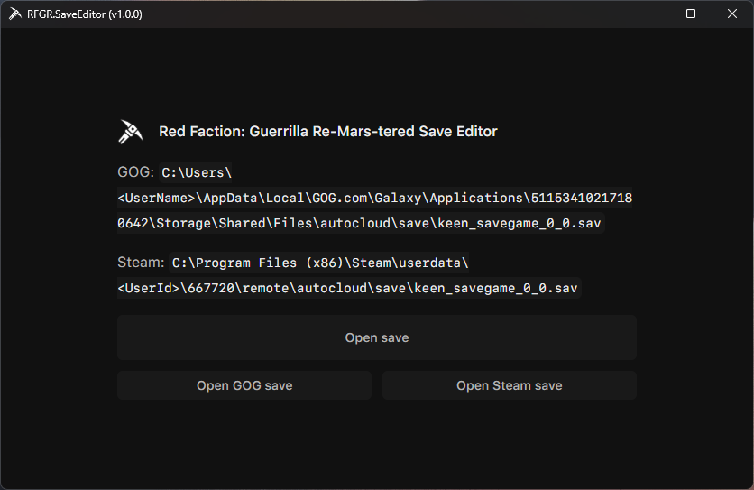
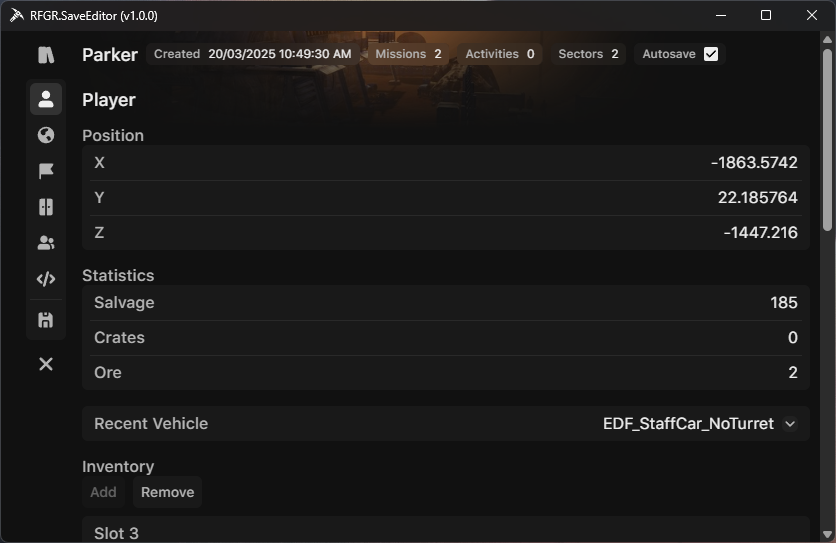
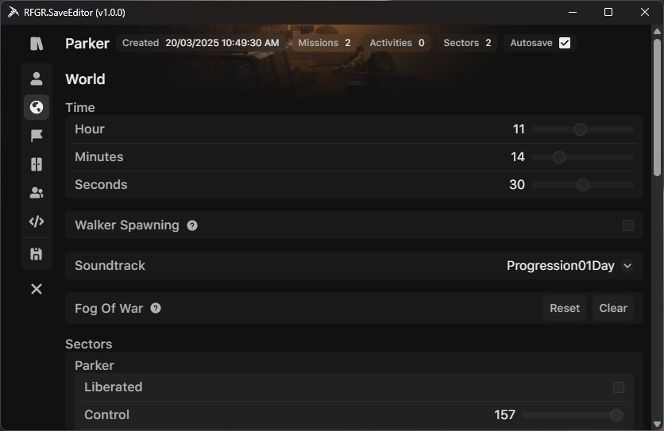
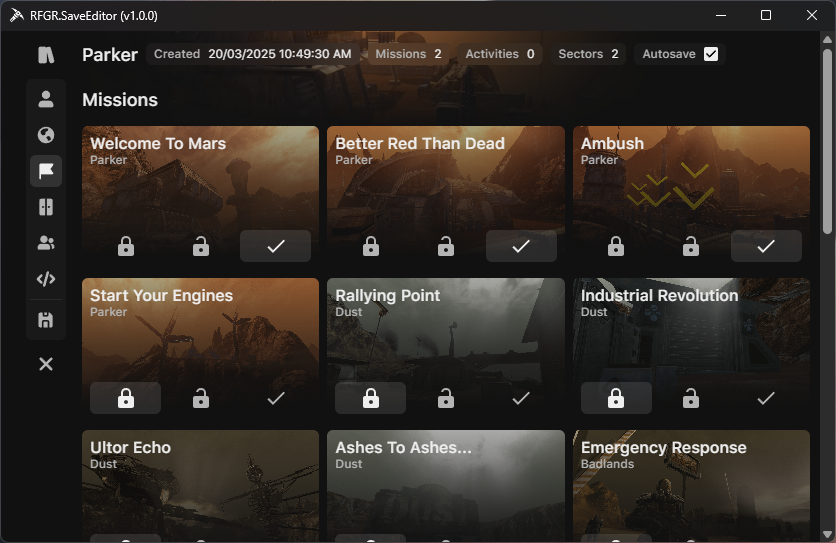
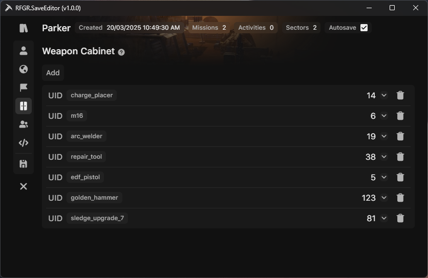
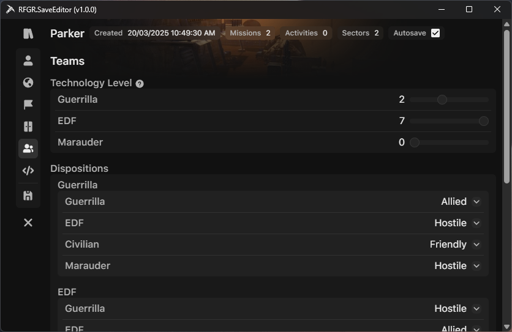
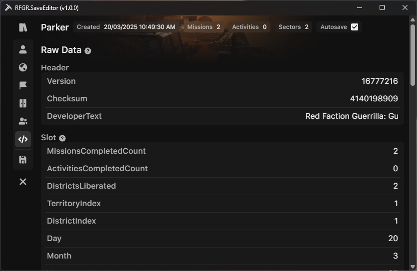
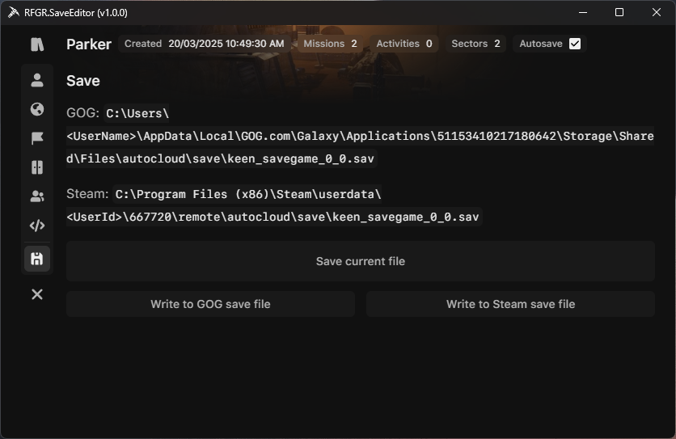

<h2>RFGR.SaveEditor</h2>

A save editor for Red Faction: Guerrilla Re-Mars-tered. Compatible with [GOG](https://www.gog.com/en/game/red_faction_guerrilla_remarstered) and [Steam](https://store.steampowered.com/app/667720/Red_Faction_Guerrilla_ReMarstered/).

## Features
* File opening/saving
    * Auto-detects GOG and Steam save file locations
    * Automatically backs up file upon saving
* Data viewing/editing
  * Slots
    * View up to 12 total slots
    * Toggle autosave status
    * View both base game and DLC slots in one list
  * Player
    * Modify position
    * Set statistics
    * Add or remove weapons to inventory
    * Set last driven vehicle
    * Toggle cheats
  * World
    * Set time of day
    * Toggle walker spawning
    * Set soundtrack progression
    * Reset/clear fog of war
    * Modify sector control, morale, and liberation status
  * Missions
    * Set to locked, unlocked, or completed
  * Weapon cabinet
    * Add or remove weapons
  * Teams
    * Set technology level
    * Modify team dispositions
  * Raw data
    * View inner values of save file
    * Modify multiplayer statistics
    
## Usage
1. Download and extract the latest version from the [releases](https://github.com/arrowsv/RFGR.SaveEditor/releases) page

2. Run `RFGR.SaveEditor.exe`
   * .NET Desktop Runtime 8.0.14 is required for the program to run. If the runtime is not installed, the program should show a prompt for installation. If this does not appear, download and install the runtime manually [here](https://dotnet.microsoft.com/en-us/download/dotnet/8.0).

3. Open a save file
   * To manually browse for a `.sav` file, click the `Open save` button. The save file should be named `keen_savegame_0_0.sav`.
   * If the program successfully detected a GOG and/or Steam `.sav` file, the `Open GOG save` or `Open Steam save` buttons can be clicked.
      * Auto-detection will typically fail if the registry keys are empty or cannot be found. Steam detection can also fail if it's not running at the time of launching the save editor.
   * Click the `X` button on the left side of the screen to open a different save file.

4. Edit and view data
   * To change the selected slot, click the book icon in the top left and select a slot in the dropdown. These will appear in the same order shown in-game.
   * To modify a value, click on the white text at the right of the screen.
      * A value with an arrow button on its right is a dropdown for preset values, such as weapons and vehicles. Not all values in the game files were added as a preset.
      * Some values are read-only and can only be modified via the dropdown, such as team dispositions and soundtrack progression.

5. Save changes to file
   * Click the save file icon in the tab list on the left of the screen.
   * To overwrite the currently opened save file with the new changes, click the `Save current file` button.
   * If the program successfully detected a GOG and/or Steam save file directory, the `Write to GOG save file` or `Write to Steam save file` buttons can be clicked.
      * These buttons are only here to satisfy a specific use case in which you would only want the save file to be updated for a specific platform. The `Save current file` button should satisfy all other cases.
   * The original save file will be copied and renamed to `keen_savegame_0_0-{year}-{month}-{day}_{hour}-{minute}-{second}.sav`.

## Screenshots

## Issues
* Not all values have strict validation outside enforcing a minimum/maximum and making sure non-text values aren't empty. There may be undiscovered limits that are enforced in-game.
* Certain save files may have a cheat that is unlocked in-game but not shown in the `Cheats` list on the `Player` tab. This may be an artifact of a Steam Edition save file that has been converted to be compatible with Re-Mars-tered.
* Weapons shown in the `Inventory` section on the `Player` tab may have large magazine sizes that don't reflect in-game values. Unsure of the cause.
* The display information of the slot will not change until the slot is re-saved in the game.
* Changing values such as mission and sector statuses will not reflect as accurately as it would do if they were completed/liberated in-game by the player. This is because doing those actions in-game triggers scripts that do other things, such as unlocking upgrades, cheats, updating technology levels, and other environmental changes. This may become a feature in the future.

## Credits
* [Rast1234](https://github.com/Rast1234) - testing and feature suggestions
